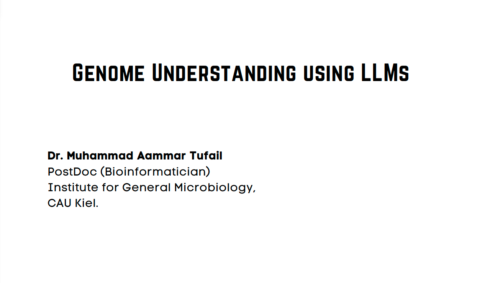

# **Genome Understanding using LLMs**

## Repository Link

[https://github.com/your_username/your_project_name]

## Description

This project aims to apply large language models (LLMs) to the problem of understanding genomic sequences, specifically FASTA files. The primary goal is to leverage transformer-based architectures such as DNABERT, DNABERT-2, and the Nucleotide Transformer to analyze and interpret DNA sequences. This approach seeks to improve the prediction of genomic elements (e.g., promoters, splice sites, transcription factor binding sites) and to explore the potential of pre-trained models in genomics for bioinformtics, personalized medicine and biotechnology applications.

### Task Type

Fine Tunning LLMs for Genome Understanding

### Results Summary

- **Best Model:** DNABERT-2
- **Evaluation Metric:** Training time was too much for the dataset, so I stopped the training after few Hours.
- **Result:** Could not complete the training, but the model was able to learn the patterns in the data.

## Documentation

1. **[Literature Review](0_LiteratureReview/README.md)**
2. **[Dataset Characteristics](1_DatasetCharacteristics/README.md)**
3. **[Baseline Model](2_BaselineModel/Baseline_model_DNABERT2.ipynb)**
4. **[Fine Tuning LLM](3_Model_fine_tuning/README.md)**
5. **[Presentation](4_Presentation/README.md)**

## Cover Image

----
